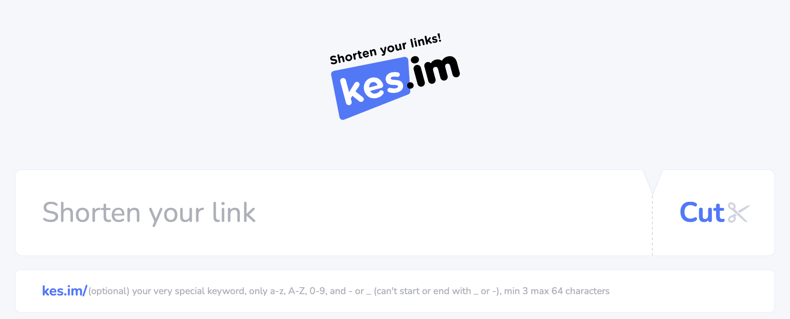

# ✂️ [kes.im](https://kes.im) URL Shortener

[kes.im](https://kes.im) is an ad-less no-log URL shortener. Works on [Cloudflare Workers](https://workers.cloudflare.com/). Developed with pure front-end and workers TS code. Uses [D1](https://www.cloudflare.com/developer-platform/d1/) as database (currently migrating from KV on the fly).

# Architecture Overview

Currently there are 3 packages: [common](./packages/common), [worker](./packages/worker/) and [site](./packages/site). **Common** is a library package used by other two. **Worker** is the actual Cloudlfare worker code which includes api and static asset server. Lastly **site** includes the front-end app and all public static assets to serve.

Every package includes an `pre-deploy.js` which is called before deployement to check, test and build the package. Check pre-deploy scripts of packages to see what's going on.

There are also [tools](./tools/) to help with repetitive tasks.

- [githooks](./tools/githooks/) tool is to set some git hooks. It'll set pre-commit hook, which will run the whole pre-deploy process to make sure your commit doesn't break anything. See the script to add or edit current hooks.
  - to set hooks, run `npm run set:githooks`
- [prepare](./tools/prepare/) tool basically prepares the whole repo to function and deploy. For example it generates banned.ts file from the lists under [assets/banneds](./assets/banneds/), some build meta data to use as build info, and also extracts env variables from [wrangler.toml](./packages/worker/wrangler.toml) to `packages/site` with type support by also copying output file of `wrangler types`. If you confused what this guy does, just read the script and run it to see its effects.
  - to do preparation, run `node tools/prepare`
- [pre-deploy](./tools/pre-deploy/) tool prepares whole project for deployement. It'll first runs the `prepare` script explained above and then loops through packages folder and runs every package's `pre-deploy.js` script.

All env variables are declared in [wrangler.toml](./packages/worker/wrangler.toml), basically it is the source of truth. `prepare` tool is taking care of distributing it to the other packages, which are only the `site` for now.

# How to Develop & Deploy

Project includes a github action [recipe](./.github/workflows/test-and-deploy.yml) which helps you to deploy on Cloudflare. You can also deploy it from your machine. Follow these steps to make project your own. If you find something not working along the steps, create an issue.

## Local Development

#### 0. Clone & Init the Repo

Clone the repo and do `npm install` in the root of course.

#### 1. Update wrangler.toml

See the [wrangler.toml](./packages/worker/wrangler.toml). You need to update related fields, such as `account_id`, `routes` and `id`s of bindings such as `D1`.

- Update `account_id` with yours.
- Update `routes` if you have a domain. (You can probably skip this step for local development.)
- Create a D1 database in your Cloudflare dashboard and enter its id.

Do these steps for both `[env.prod]` and `[env.local]` while you're at it.

#### 1. Add hostnames

Since worker serves both API and redirection endpoints, worker needs hostnames to distinguish between API and redirection calls. For this we need to define 2 hostnames. If you don't know how to do it see [this](https://www.liquidweb.com/blog/edit-hosts-file-macos-windows-linux/), or just do a web search.

Add following hostnames to your system:

    127.0.0.1 api.local.kes.im
    127.0.0.1 local.kes.im

#### 2. Create local D1 table.

    $ cd packages/worker

    $ npx wrangler d1 execute kesim --env local --local --file=../../assets/db/init.sql

#### 3. Pre-Deploy the Project

    $ WORKER_ENV=local node tools/pre-deploy

This will do required main preparations and also package based preparations such as installing dependencies. This will also run the current tests so you'll know if everything is initially working or not. `WORKER_ENV=local` configures the app to use `[env.local]` settings from the [wrangler.toml](./packages/worker/wrangler.toml).

#### 4. Run the Worker

    $ cd packages/worker

    $ npm run dev

We'll use worker only as API and redirection endpoint in local settings. After running it navigate to [api.local.kes.im:3000](http://api.local.kes.im:3000) to test it. You should see a JSON with `hello: Whatcha doin'?` in it. Same as the one [here](https://api.kes.im).

Observe that `wrangler dev` uses local databases by default. If you want to connect your remote database from local development run `npm run dev:remote` instead, be careful tho.

#### 5. Run the Site

This may require you to enter your password. Reason is it creates local certificate for `https` via [this plugin](https://github.com/liuweiGL/vite-plugin-mkcert). Https is required to use `navigator.clipboard.writeText` functionality in browser to copy short links in clipboard.

    $ cd packages/site

    $ npm run dev

After running it navigate to [local.kes.im:5000](https://local.kes.im:5000) to test it.

#### 6. Enjoy

Everything has to be working now. Since ssl certificates created locally, some browsers may complain or have trouble about this. Other than that, there shouldn't be any issue, if there is, open an issue.

Notice that if you change anything that prepare tool forwards to packages, such as adding new env vars to wrangler.toml or adding new banned keywords to assets/banneds etc, you need to re-run it from root such as `WORKER_ENV=local node tools/prepare`.

## Deployment

#### 0. Configure [wrangler.toml](./packages/worker/wrangler.toml)

If you haven't already, configure your wrangler.toml now, see the step details under local development title.

#### 1. Add Secrets

For both options (deploying from local/ci) you need to add secret environment variables to your worker. These secrets are missing from [wrangler.toml](./packages/worker/wrangler.toml) since, you guessed it, they are secrets.

- `TURNSTILE_SECRET`: System uses [Turnstile](https://developers.cloudflare.com/turnstile//) for user validation. You can disable it from env vars by setting `CF_TURNSTILE_ENABLED=false` in wrangler.toml. It is already disabled for local development. Otherwise, you need to activate turnstile for your site in Cloudflare dashboard and enter its secret to your [worker's secrets](https://developers.cloudflare.com/workers/configuration/secrets/).

#### 2. Initialize D1

Now you need to initialize your remote database with table schema:

    $ cd packages/worker

    $ npx wrangler d1 execute kesim --env prod --remote --file=../../assets/db/init.sql

See [some commands](./assets/db/docs/init.md) to test your D1 database initialization.

## Deploying from Local

Assuming you already configured your [wrangler.toml](./packages/worker/wrangler.toml) and did steps in previous section (such as adding your secrets). Now you can simply do:

    npm run manual-deploy:prod

This will create everyting required for the deployement and deploy the worker.

## Deploying with GitHub Actions

Project also have a [GitHub workflow](./.github/workflows/test-and-deploy.yml) to auto deploy on push. You may need to change branch name here if your prod code sits somewhere else. Otherwise this will deploy worker on every push to the branch.

Only additional thing this step requires is your `CLOUDFLARE_API_TOKEN` to be defined as [repository or env secrets in your GitHub repository](https://docs.github.com/en/actions/security-guides/using-secrets-in-github-actions). So make sure to get a [API token from Cloudflare](https://developers.cloudflare.com/fundamentals/api/get-started/create-token/) and add it as a secret to your repository.

# Contributors [𐃉](https://github.com/ramesaliyev/kes.im/graphs/contributors)

Contributions are always welcome.
- [Cihat İslam Dede](https://github.com/cihatislamdede)
